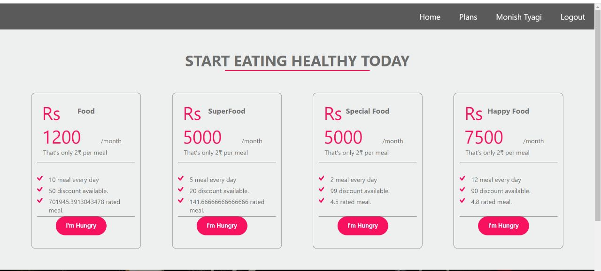

# Food App MERN Project
## Images

## Technology 👇
- ReactJS
- Express
- Mongodb Atlas
- Github
  
### contact 
💼 Pull requests help you collaborate on code with me [issues and pull requests]() :)

 💼 if you have any doubt? do reach, [email](monishtyagi5770@gmail.com) :)

## pages
* User
  * Login Page
  * Signup Page
  * Forget Password
  * ResetPassword Page
  * Email support
  * Profile Page
      * user details : Email ,Name,img
      * Booked Plans
  * Home : 
    * Majorly Static
    * Top 3 Plans
    * Top 3 reviews
* Plans
  * All Plans
  * Plan Details
    * Discreption of the plan
    * Buy Now Button
    * Reviews  
## Backend Architecture:  MVC architecture, REST API
:writing_hand: CRUD Operations
:closed_lock_with_key: JWT Authentication
:dollar: Stripe Payment Integration
:rocket: Deployment 
## Database : MongoDb,Mongoose
## Authentication : Json web token 
## 3rd party : 
        * Payment GateWay:Stripe
        * Email:  nodemailer,gmail
## Testing : Postman
## Frontend : React, Backend : Express
## Deployment : 
    * Backend :Vercel 
    * Frontend : Netlify
    * Codebase : Github
    * Database server : MongoDB Atlas 
* Futher improvement : videos, feedback ,meal level  

